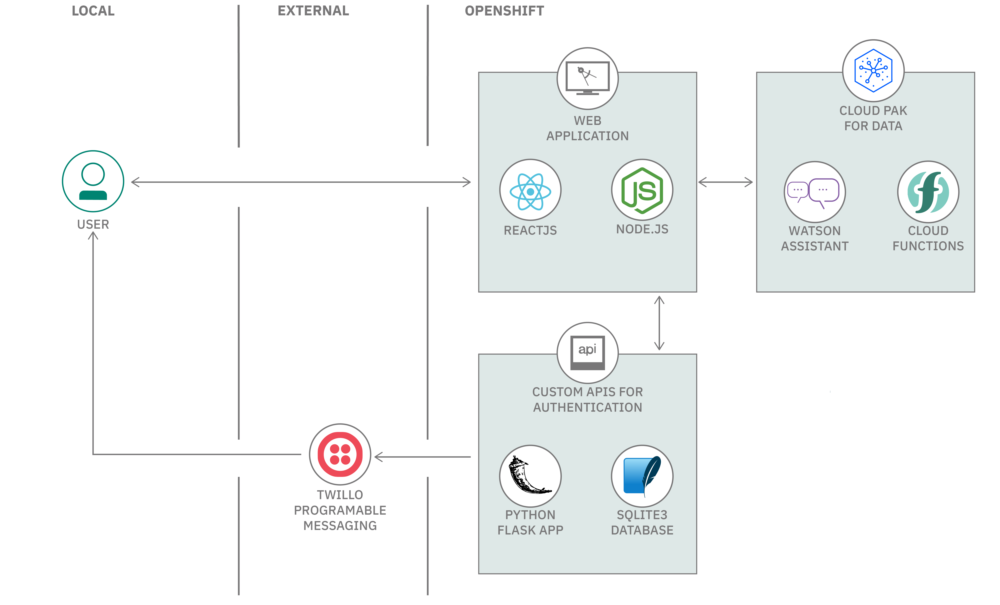
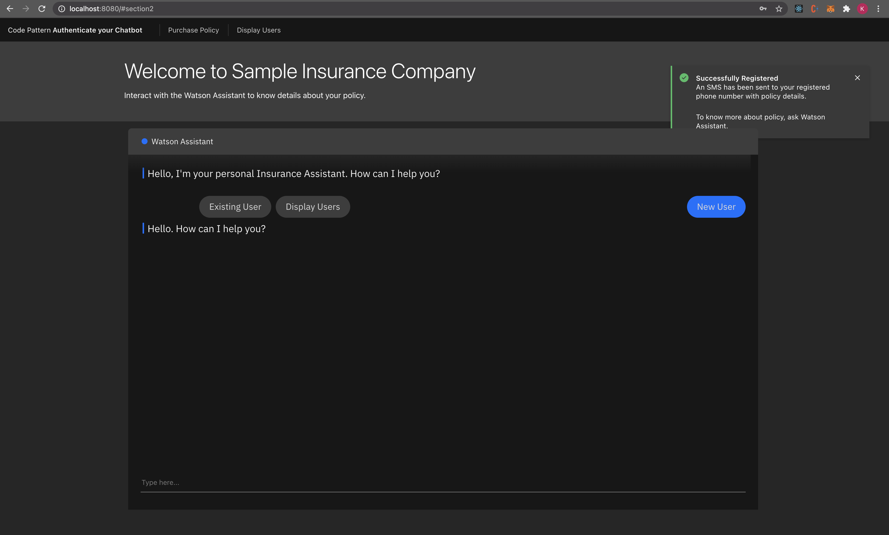

# Authenticate users on your chatbot with SMS one time passcode

Chatbots are prevelent everywhere. Some conversations are confidential and hence chatbots have to verify authenticity of users. Sending an OTP via SMS is a popular way to identify a user. 

In this code pattern we will provide steps to build a chatbot apllication that authenticates users through an SMS one time passcode (OTP). An insurance customer can use chatbot to get more information on his/her insurance policy. We will demonstate the usage of Watson Assistant, Cloud Functions and Custom APIs to build this application.

When you have completed this code pattern, you will understand how to:

* Build conversational interfaces into any application, device, or channel.
* Run your application code without servers.
* Build APIs to authenticate users on your chatbot.
* Make external API calls through Watson Assistant.



## Flow

1. User registers themselves on the insurance portal
2. User data is stored in the database
3. The policy details are redirected to twilio
4. Twilio sends an SMS to the user’s phone number with the policy details
5. User asks confidential info related to the policy by entering the policy number
6. The Query is sent to watson assistant
7. Watson Assistant sends out the request to cloud functions
8. Cloud function makes an API call to the custom API
9. The user’s phone number is searched in the database and redirected to twilio
10. Twilio sends an SMS with OTP valid for 5 mins to the user
11. User enters the OTP
12. The OTP is sent to watson assistant
13. Watson assistant sends out the OTP to cloud functions
14. Cloud function makes an API call to the custom API with the user entered OTP
15. OTP is validated in the backend
16. If the OTP is valid, the user requested confidential info is fetched form the database 
17. Cloud function returns the confidential info to Watson Assistant
18. Watson Assistant displays the user requested confidential info
19. User can see the confidential info in the Web UI

# Watch the Video

Coming Soon.
<!-- [](https://www.youtube.com/watch?v=Jxi7U7VOMYg) -->

# Steps

1. [Clone the repo](#1-clone-the-repo).
2. [Create a Twilio service](#2-create-a-twilio-service).
3. [Deploy Custom APIs on Cloud](#3-deploy-custom-apis-on-cloud).
4. [Create a Cloud Function Action](#4-create-a-cloud-function-action).
5. [Create Watson Assistant Services](#5-create-watson-assistant-services).
6. [Import the Watson Assistant workspace](#6-import-the-watson-assistant-workspace).
7. [Configure Watson Assistant with Cloud Function URL](#7-configure-watson-assistant-with-cloud-function-url).
8. [Run the Web Application](#8-run-the-web-application).

### 1. Clone the repo

Clone the `authenticate-users-on-your-chatbot-with-sms-otp` repo locally. In a terminal, run:

```bash
git clone https://github.com/IBM/authenticate-users-on-your-chatbot-with-sms-otp.git
```

### 2. Create Twilio service

### 3. Deploy Custom APIs on Cloud

### 4. Create a Cloud Function Action
*  [Create a cloud function](https://cloud.ibm.com/functions/create/action)
* Enter a cloud function name and select Python 3.7 for runtime environment and press create.


* You will see a hello world code in the canvas


* Copy the code from [here](cloud-function-action/otp-auth.py) and replace it in the canvas as shown.


* Replace the `APIENDPOINT` in the code with the URL that you copied to your notepad in [Step 5](#5-deploy-custom-apis-on-cloud).
>Example: APIENDPOINT = "http://158.123.197.53:32000"

* Click on **Endpoints** on the left panel and select **Enable as Web Action** finally click on **Save**.


* Finally Copy the Public Link which is displayed.

>NOTE: The Above URL should end with .json if it is not ending with .json please append .json at the end of the URL. 
**NOTE: This URL is Important, please save it in any notepad since it will be used in subsequent steps.**


### 5. Create Watson Assistant services

* Create a [Watson Assistant](https://cloud.ibm.com/catalog/services/watson-assistant) service.


* Click **Launch Watson Assistant** to launch console.


### 6. Import the Watson Assistant workspace
* Inside Watson Assistant Console click **Skills icon** on the left panel and then click **Create skill**.


* Select **Dialog Skill** and click next.


* Select **Upload** and choose `watson-assistant-skills/skill-OTP-Authentication-New.json` from the project directory and click **Upload.**


* After this you will see that a new Watson Assistant skill has been created.

* Click **Assistant icon** from left panel and click **Create Assistant.**


* Enter a Name and description for the Assistant and click **Create.**


* Click **Add dialog Skill.**


* Select the **OTP Authentication New** skill that we just uploaded.


* Now you can see that skill has been added to the assistant. Now navigate back to Assistants page by clicking the back button as shown below.


* Click the three dots at the side of OTP Auth skill to see the dropdown menu and select **Settings**.


* Copy the Assistant ID, Assistant URL and the API key and store them in a file as they will be used in subsequent steps.

>Note: Copy only the hostname in Assiatant URL and not the complete path. eg-
`https://api.eu-gb.assistant.watson.cloud.ibm.com/`

### 7. Configure Watson Assistant with Cloud Function URL
* Go to the Watson Assistant skills and select **OTP Authentication New**


* Select Options>Webhooks from the left panel and paste the URL copied in [Step 4](#4-create-a-cloud-function-action) in the text box.


### 8. Run the Web Application
* Open the repository in your terminal and navigate to `node-web-application` directory.
* Start the app by running `npm install`, followed by `node server.js`.
* Open at `localhost:8080` in your browser. As the authentication has not been done yet, you will be redirected to `/auth`.
* Click Add Credentials and Enter the required credentials that you copied in [Step 6](#6-import-the-watson-assistant-workspace) and press **Submit**.

* After successful authentication user will be redirected to the chatbot.
* Click on New User to start using the app.

* Select Any Policy you like and click **Buy Now.**

* Enter your details and click **Submit.**

* After Successful registration you will see a success prompt and you will received the policy details on your registered mobile number.

* You can now interact with chatbot and know your confidential information in a secure manner.


> Note: The server host can be changed as required in the server.js file, and `PORT` can be set in the `.env` file.

## Questions
If you have any questions or issues you can create a new [issue here][issues].

Pull requests are very welcome! Make sure your patches are well tested.
Ideally create a topic branch for every separate change you make. For
example:

1. Fork the repo
2. Create your feature branch (`git checkout -b my-new-feature`)
3. Commit your changes (`git commit -am 'Added some feature'`)
4. Push to the branch (`git push origin my-new-feature`)
5. Create new Pull Request

## License

This code pattern is licensed under the Apache License, Version 2. Separate third-party code objects invoked within this code pattern are licensed by their respective providers pursuant to their own separate licenses. Contributions are subject to the [Developer Certificate of Origin, Version 1.1](https://developercertificate.org/) and the [Apache License, Version 2](https://www.apache.org/licenses/LICENSE-2.0.txt).

[Apache License FAQ](https://www.apache.org/foundation/license-faq.html#WhatDoesItMEAN)
