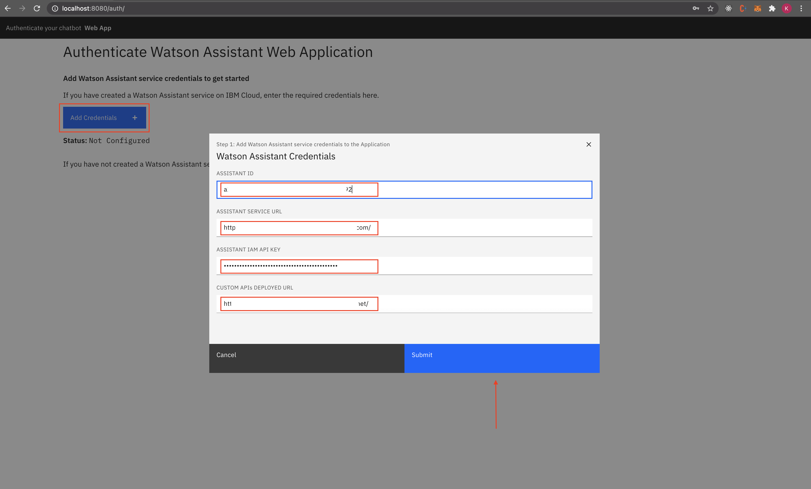

# Authenticate users on your chatbot with SMS one time passcode

Chatbots are prevalent everywhere. Some conversations are confidential and hence chatbots have to verify authenticity of users. Sending an OTP via SMS is a popular way to identify a user. 

In this code pattern we will provide steps to build a chatbot application that authenticates users through an SMS one time passcode (OTP). For example, a customer holding an insurance policy can use chatbot to get more information about his/her insurance policy. We will demonstrate the usage of Watson Assistant, Cloud Functions and Custom APIs to build this application.

When you have completed this code pattern, you will understand how to:

* Build conversational interfaces into any application, device, or channel.
* Run your application code without servers.
* Build APIs to authenticate users on your chatbot.
* Make external API calls through Watson Assistant.


## Flow


1. User registers for a policy on the portal.
2. User data is stored in the database and policy details are sent to user’s phone number in an SMS through Twilio Messaging API.
3. User interacts with chatbot and asks for confidential info related to the policy. The user is prompted to enter OTP by Watson Assistant.
4. The query is sent to Watson Assistant which in turn invokes Cloud function to make an API call to the user defined backend API for retrieving info.
5. The user’s phone number is searched in the database and OTP generated by backend API is sent to user through Twilio.
6. User enters the OTP, in the chat application to authenticate himself/herself.
7. Watson Assistant validates OTP by interacting with backend API.
8. If the OTP is valid, the user requested confidential info is fetched from the database.
8. Cloud function returns the confidential info to Watson Assistant.
10. Watson Assistant displays the user requested confidential info.
11. User can see the confidential info in the Web UI.

# Watch the Video

Coming Soon.
<!-- [](https://www.youtube.com/watch?v=Jxi7U7VOMYg) -->

# Prerequisites
1. [IBM Cloud Account]()
2. [IBM Cloud CLI]()
3. [OpenShift ROKS Cluster]()
4. [OC CLI]()
5. [Git CLI]()

# Steps

1. [Clone the repo](#1-clone-the-repo).
2. [Create Twilio service](#2-create-twilio-service).
3. [Deploy Custom APIs](#3-deploy-custom-apis).
4. [Create a Cloud Function Action](#4-create-a-cloud-function-action).
5. [Create Watson Assistant Services](#5-create-watson-assistant-services).
6. [Import Watson Assistant workspace](#6-import-watson-assistant-workspace).
7. [Configure Watson Assistant with Cloud Function URL](#7-configure-watson-assistant-with-cloud-function-url).
8. [Run the Web Application](#8-run-the-web-application).

### 1. Clone the repo

Clone the `authenticate-users-on-your-chatbot-with-sms-otp` repo locally. In a terminal, run:

```bash
git clone https://github.com/IBM/authenticate-users-on-your-chatbot-with-sms-otp.git
```


### 2. Create Twilio service

Twilio is a SaaS offering that provides APIs to make and receive calls or text messages. We will be using Twilio to send SMS to user programmatically from backend. Lets start by creating a free Twilio service.

- Create a free Twilio service here: <https://www.twilio.com/try-twilio>.

>NOTE: - Once you create a Twilio service, you will have to verify your email id as well as your phone number.

>- You will receive verification link in the email provided during Twilio sign up. Go ahead and verify your email id.


- Once email id is verified you will be prompted to enter your phone number, submit that and you will get an OTP on your registered number, enter that back to verify.

    

- On successful verification you should see a welcome greeting message, additionally you will see a question **Do you write code?**, select **Yes** to proceed.


    

- The second question asked to you would be **What is your preferred language?**, select **Python** to proceed.

    

- Third question asked to you would be **What is your goal today?**, select **Use Twilio in a project** to proceed.

    

- The final question asked to you would be **What do you want to do first?**, select **Skip to dashboard** to proceed.

    

- You will need a Twilio `Trial Number` to send messages(OTP). Click on **Get a Trial Number** as shown.

    

- Click on **Choose this Number** to continue. 

    

- A confirmation will be displayed once the number is generated, click on **Done**.

    

- To establish connection between the APIs and Twilio we need to get the `trial_number`, `account_sid` and `auth_token` from Twilio. 

- Visit <https://www.twilio.com/console> and expand the **Project Info** tab. You will see the `TRIAL NUMBER`, `ACCOUNT SID` and `AUTH TOKEN`, copy it in some notepad as it will be used in [Step 3](#3-deploy-custom-apis-on-cloud).

    

- At this point, you should have the `TRIAL NUMBER`, `ACCOUNT SID` and `AUTH TOKEN` from Twilio service.

#### Verified Caller IDs

Twilio trial number doesn't send messages to your phone number if your phone number is not added to the `Verified Caller IDs` list. This is a limitation of a free trial number. Visit <https://www.twilio.com/console/phone-numbers/verified> and add your phone number to the verified caller ID list before you continue.

- Now lets deploy the custom APIs and configure twilio credentials.

### 3. Deploy Custom APIs

In this code pattern, custom APIs are developed to perform various tasks such as:
    - Store users data in a Database
        - Search users phone number and send out an OTP
        - Validate OTP and Authenticate users
        - Query users data

Custom APIs are developed in Python Flask and you can deploy it in OpenShift or IBM Cloud Foundry.

<details><summary><b>Steps to Build and Deploy on OpenShift</b></summary>

<b>Note:</b> If you want to deploy the Custom APIs without any modifications, you can skip the **Build** steps and directly follow the **Deploy** steps. If you want to make some modifications in the APIs and then deploy it then follow the **Build** step.


#### Build
> Note: Make sure you have docker cli installed and logged in to DockerHub

- In cloned repo, navigate to `custom-apis-for-authentication/` directory and build the docker image. In terminal run:
```bash
$ docker build -t <your-docker-username>/otp-apis:v1 .
```
> Replace `<your-docker-username>` with your docker hub username

- Once the docker image is built, deploy the docker image to Dockerhub. In terminal run:
```bash
$ docker push <your-docker-username>/otp-apis:v1
```

- At this point you have built the container image and successfully pushed to to a container repository dockerhub. 

- Copy the image tag `<your-docker-username>/otp-apis:v1` and replace it on line no `18` in `deployment-scripts/api-deploy.yaml`

<pre><code>spec:
      containers:
      - name: otp-apis
        image:<b> < your-docker-username >/otp-apis:v1 </b>
        ports:
        - containerPort: 8080
</code></pre>


#### Deploy

- Login to your OpenShift cluster, In terminal run:
```bash
$ oc login -u <username> -p <password>
```

- Alternatively you can also login with an auth token. Follow the [Step here](https://developer.ibm.com/tutorials/configure-a-red-hat-openshift-cluster-with-red-hat-marketplace/#4-connect-to-the-openshift-cluster-in-your-cli) to login through an auth token.

- Once you have logged into OpenShift from your terminal, you can run the `oc apply` command to deploy the Application on OpenShift. In cloned repo, navigate to `deployment-scripts/` directory and in terminal run:
```bash
$ cd deployment-scripts/
$ oc apply -f api-deploy.yaml
```

```
deployment.apps/otp-apis created
service/otp-apis-service created
route.route.openshift.io/otp-apis-url created
```

- A deployment, service and a route will be created. To access the App, In terminal run:
```bash
$ oc get route -n default
```

```
NAME           HOST/PORT                                                                                                           PATH   SERVICES           PORT   TERMINATION   WILDCARD
otp-apis-url   otp-apis-url-default.xxx.us-south.containers.appdomain.cloud   /      otp-apis-service   8080                 None
```

- You will see the `PATH` for with service name `otp-apis-url`.
- Make a note of this url, as `APIEndPoint` to be used in step 4.

>Example: http://otp-apis-url-default.xxx.us-south.containers.appdomain.cloud

- At this point, you will have successfully deployed the Custom APIs on OpenShift. Now lets access it and see how it looks like.

</details>

<details><summary><b>Steps to Build and Deploy on IBM Public Cloud Foundry</b></summary>

#### Build and Deploy

- Before you proceed, make sure you have installed [IBM Cloud CLI](https://cloud.ibm.com/docs/cli?topic=cloud-cli-getting-started&locale=en-US) in your deployment machine.

- From the cloned repo, goto **custom-apis-for-authentication** directory in terminal, and run the following commands to deploy the Application to IBM Cloud Foundry.

    ```bash
    $ cd custom-apis-for-authentication/
    ```

* Log in to your IBM Cloud account, and select an API endpoint.
    ```bash
    $ ibmcloud login
    ```

    >NOTE: If you have a federated user ID, instead use the following command to log in with your single sign-on ID.

    ```bash
    $ ibmcloud login --sso
    ```

* Target a Cloud Foundry org and space:
    ```bash
    $ ibmcloud target --cf
    ```

* From within the _custom-apis-for-authentication_ directory push your app to IBM Cloud.
    ```bash
    $ ibmcloud cf push otp-api
    ```

- The [manifest.yml](custom-apis-for-authentication/manifest.yml) file will be used here to deploy the application to IBM Cloud Foundry.

- On Successful deployment of the application you will see something similar on your terminal as shown.
<pre><code>
Invoking 'cf push'...
Shown below is a sample output
    
Pushing from manifest to org manoj.jahgirdar@in.ibm.com<Do not reveal your ibm id here> / space dev as manoj.jahgirdar@in.ibm.com...
    
...
    
Waiting for app to start...
    
    name:              otp-api
    requested state:   started
    routes:            <b>otp-api.xx-xx.mybluemix.net </b>
    last uploaded:     Sat 16 May 18:05:16 IST 2020
    stack:             cflinuxfs3
    buildpacks:        python
    
    type:            web
    instances:       1/1
    memory usage:    512M
    start command:   python app.py
        state     since                  cpu     memory           disk           details
    #0   <b>running</b>   2020-05-16T12:36:15Z   12.6%   116.5M of 512M   796.2M of 1
</code></pre>

* Once the app is deployed you can visit the `routes` to launch the application. <mention how to get to the routes.. may be from output of above command?>
* Make a note of this url, as `APIEndPoint` to be used in step 4.

>Example: http://otp-api.xx-xx.mybluemix.net

- At this point, you will have successfully deployed the Custom APIs on IBM Cloud. Now lets access it and see how it looks like.

</details>

Once you have deployed the Custom APIs, continue with the documentation:

- Visit the `URL` in your browser to access the framework.

    

- Click on the **Add Twilio Credentials** button and enter the `TRIAL NUMBER`, `ACCOUNT SID` and `AUTH TOKEN` copied in [Step 2](#2-create-twilio-service). and click Submit

    

- Once the credentials are entered you will see the status as `Configured` as shown.

    

- At this point you will have successfully deployed and configured the custom APIs.

### 4. Create a Cloud Function Action

IBM Cloud Function is a Serverless Architecture where in a user can write a snippet of code and run it as API's without worrying about deploying it. Through webhook we will be using Cloud Function Actions to interact with our external database API and exchange data.

- Login to IBM Cloud, and [Create a cloud function action](https://cloud.ibm.com/functions/create/action).
- Click "Start Creating " button. Select "Action".
* Enter a cloud function name and select Python 3.7 for runtime environment and click `create`.


* You will see a hello world code in the canvas


* Copy the code from [here](cloud-function-action/otp-auth.py) and replace it in the canvas as shown. In 2-3 sentences explain what this code does.


* Replace the `APIENDPOINT` in the code with the URL that you copied to your notepad in [Step 3](#3-deploy-custom-apis).
>Example: APIENDPOINT = "http://158.123.197.53:32000" This url to be similar to route one (without IP). Make a mention that it should be http in case of openshift deployment.

* Click on **Endpoints** on the left panel and select **Enable as Web Action**. Click on **Save**.


* Copy the Public Link which is displayed.

>NOTE: The Above URL should end with .json if it is not ending with .json please append .json at the end of the URL. 
**NOTE: This URL is Important, please save it as CLOUD_FUNCTION_URL in any notepad since it will be used in subsequent steps.**

### 5. Create Watson Assistant services

* Create a [Watson Assistant](https://cloud.ibm.com/catalog/services/watson-assistant) service. Provide instructions to select region, lite plan and click create. Wait for a few seconds for an instance to be provisioned. Because this code pattern is generic and has wide applicability, expect beginners also to execute this code pattern.


* Click **Launch Watson Assistant** to launch console.


### 6. Import Watson Assistant workspace
* Inside Watson Assistant Console click **Skills icon** on the left panel and then click **Create skill**.


* Select **Dialog Skill** and click next.


* Select `Upload Skill ` tab. Drag and drop (or click and browse) the file `watson-assistant-skills/skill-OTP-Authentication-New.json` from the project directory and click **Upload.**


* After this you will see that a new Watson Assistant skill has been created.

* Click **Assistant icon** from left panel and click **Create Assistant.** In below images, we can cut images to remove the blank space from images.


* Enter a Name and description(optional) for the Assistant and click **Create.**


* Click **Add dialog Skill.**


* Select the **OTP Authentication New** skill that we just uploaded.


* Now you can see that skill has been added to the assistant. Now navigate back to Assistants page by clicking the back button as shown below.


* Click the three dots at the side of OTP Auth skill to see the dropdown menu and select **Settings**.


* Copy the Assistant ID, Assistant URL and the API key and store them in a file as they will be used in subsequent steps.

>Note: From the Assistant URL, copy the url only till the end of hostname part and not the complete path. e.g 
`https://api.eu-gb.assistant.watson.cloud.ibm.com/`

### 7. Configure Watson Assistant with Cloud Function URL
* Go to the Watson Assistant skills and select **OTP Authentication New**

* Select Options -> Webhooks from the left panel and paste the CLOUD_FUNCTION_URL(ending in .json) copied in [Step 4](#4-create-a-cloud-function-action) in the text box.
* 

### 8. Deploy and Run the Web Application

<details><summary><b>Build and Deploy on OpenShift</b></summary>


<b>Note:</b> If you want to deploy the Web Application without any modifications, you can skip the **Build** steps and directly follow the **Deploy** steps. If you want to make some modifications in the Application and deploy it follow the **Build** step.

#### Build
> Note: Make sure you have docker cli installed and logged in to DockerHub

- In cloned repo, navigate to `node-web-application/` directory and build the docker image. In terminal run:
```bash
$ docker build -t <your-docker-username>/otp-webapp:v1 .
```
> Replace `<your-docker-username>` with your docker hub username

- Once the docker image is built, deploy the docker image to Dockerhub. In terminal run:
```bash
$ docker push <your-docker-username>/otp-webapp:v1
```

- At this point you have built the container image and successfully pushed to to a container repository dockerhub. 

- Copy the image tag `<your-docker-username>/otp-webapp:v1` and replace it on line no `18` in `deployment-scripts/webapp-deploy.yaml`

<pre><code>spec:
      containers:
      - name: otp-webapp
        image:<b> < your-docker-username >/otp-webapp:v1 </b>
        ports:
        - containerPort: 8080
</code></pre>


#### Deploy

- Login to your OpenShift cluster, In terminal run:
```bash
$ oc login -u <username> -p <password>
```

- Alternatively you can also login with an auth token. Follow the [Step here](https://developer.ibm.com/tutorials/configure-a-red-hat-openshift-cluster-with-red-hat-marketplace/#4-connect-to-the-openshift-cluster-in-your-cli) to login through an auth token.

- Once you have logged into OpenShift from your terminal, you can run the `oc apply` command to deploy the Application on OpenShift. In cloned repo, navigate to `deployment-scripts/` directory and in terminal run:
```bash
$ cd deployment-scripts/
$ oc apply -f webapp-deploy.yaml
```

```
deployment.apps/otp-webapp created
service/otp-webapp-service created
route.route.openshift.io/otp-webapp-url created
```

- A deployment, service and a route will be created. To access the App, In terminal run:
```bash
$ oc get route -n default
```

```
NAME             HOST/PORT                                                                                                             PATH   SERVICES             PORT   TERMINATION   WILDCARD
otp-apis-url     otp-apis-url-default.xxx.us-south.containers.appdomain.cloud     /      otp-apis-service     8080                 None
otp-webapp-url   otp-webapp-url-default.xxx.us-south.containers.appdomain.cloud   /      otp-webapp-service   8080                 None
```

- You will see the `PATH` for with service name `otp-webapp-url`.

>Example: http://otp-webapp-url-default.xxx.us-south.containers.appdomain.cloud

- At this point, you will have successfully deployed the Web Application on OpenShift. Now lets access it and see how it looks like.

</details>

<details><summary></b>Build and Deploy Locally</b></summary>

#### Build
- Open the repository in your terminal and navigate to `node-web-application` directory.

- In terminal, run the following to build the Application.
```bash
$ npm install
```

#### Deploy

- In terminal, run the following command to deploy and start the server.
```bash
$ node server.js
```

> Note: The server host can be changed as required in the server.js file, and `PORT` can be set in the `.env` file.

- At this point, you will have successfully deployed the Web Application locally. Now lets access it and see how it looks like.

</details>

Once you have deployed the Web Application, continue with the documentation:

- Visit the OpenShift `otp-webapp-url` route or `localhost:8080` if you have deployed locally.

- As the authentication has not been done yet, you will be redirected to `/auth`.

- Click Add Credentials and Enter Assistant ID, Assistant URL and the API Key that you copied in [Step 6](#6-import-watson-assistant-workspace) and Custom API URL as copied in [Step 3](#3-deploy-custom-apis) and press **Submit**. 


- After successful authentication user will be redirected to the chatbot.

- Click on New User to start using the app.


- Select Any Policy you like and click **Buy Now.**


- Enter your details and click **Submit.** 

>Note: The phone number should be the same as registered on Twilio.

- After Successful registration you will see a success prompt and you will have received the policy details on your registered mobile number. 
<!-- Will the SMS screenshot mislead users? Better to remove that from screenshot? -->
<!--  -->

- You can now interact with chatbot and know your confidential information in a secure manner.


## Summary
In this Code Pattern we created a chatbot using Watson Assistant which securely verifies user identity using SMS OTP authentication and interacts to display confidential information.

## Questions

If you have any questions or issues you can create a new [issue here](https://github.com/IBM/authenticate-users-on-your-chatbot-with-sms-otp/pulls).

Pull requests are very welcome! Make sure your patches are well tested.
Ideally create a topic branch for every separate change you make. For
example:

1. Fork the repo
2. Create your feature branch (`git checkout -b my-new-feature`)
3. Commit your changes (`git commit -am 'Added some feature'`)
4. Push to the branch (`git push origin my-new-feature`)
5. Create new Pull Request

## License

This code pattern is licensed under the Apache License, Version 2. Separate third-party code objects invoked within this code pattern are licensed by their respective providers pursuant to their own separate licenses. Contributions are subject to the [Developer Certificate of Origin, Version 1.1](https://developercertificate.org/) and the [Apache License, Version 2](https://www.apache.org/licenses/LICENSE-2.0.txt).

[Apache License FAQ](https://www.apache.org/foundation/license-faq.html#WhatDoesItMEAN)

